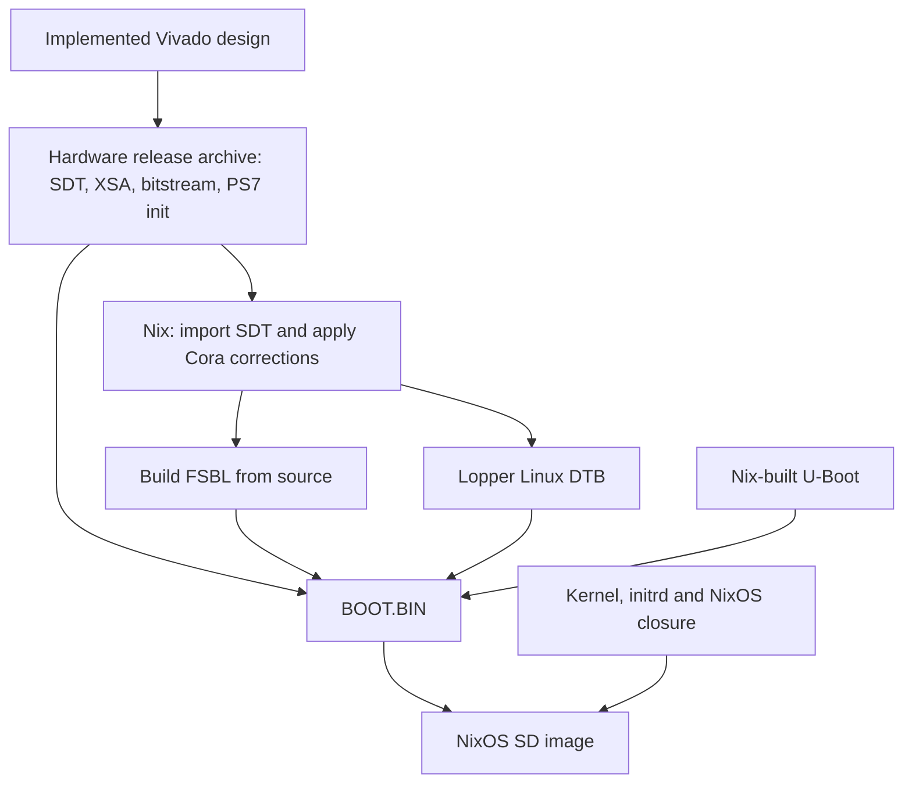

# nixos-cora-z7

Initial NixOS board support for the **Digilent Cora Z7-07S** (XC7Z007S,
one Cortex-A9, 512 MiB RAM). The default image cross-compiles from x86-64 Linux
to `armv7l-linux`. An AArch64 Linux builder is also exposed.

This is an initial bring-up cut. Nix configuration evaluation and release
export/import checks with fixtures pass. A real Vivado export, complete image
build and physical board boot still need testing. No bootable binary release
is provided yet.

## Hardware and software boundary

The [generic Zynq security foundation](security/README.md) defines the planned
authenticated-boot, protected-storage and explicit hardware-operation interfaces.
Kaiba-specific provisioning/enrollment stays downstream; Raspberry Pi remains
Kaiba's first production target. The current image remains a development image.
`nix build .#security-capabilities` exports source implementation status, not
device evidence or a secure-boot claim.

The [provisioning and qualification station design](station/README.md) describes
an unattended Cora Z7-07S Rev B fixture using an Inland KS0212 relay board,
SDWire, a Pico controller, a switchable USB hub and a Rigol DS1054Z. It includes
wiring, a bill of materials, automation contracts and commissioning gates.
It is a design, not implemented station software or physical qualification.

Vivado 2026.1 exports the hardware release. The Nix builder consumes that
release and does not need Vivado, Vitis, or an externally installed AMD tool.



AMD's documented hardware export is XSA followed by standalone `sdtgen`.
For Zynq, SDTGen produces the SDT and copies the PS7 init files and bitstream
from the XSA. The repository wraps those steps into one Vivado Tcl export
command and packages all inputs into a single `.tar.gz` release. FSBL, U-Boot
and Linux binaries are built by Nix rather than exported from Vivado.

Pinned versions:

| Component | Version |
|---|---|
| Hardware release | Vivado / SDTGen 2026.1, `xc7z007sclg400-1` |
| FSBL / libmetal / Bootgen | AMD 2026.1 release commits |
| Lopper | AMD 2026.1 release, 1.3.2 |
| Linux | AMD 2026.1 LTS recipe pin, 6.18.10 |
| U-Boot | AMD 2026.1 recipe pin, 2026.01 |
| NixOS | 25.11, exact inputs in `flake.lock` |

Exact AMD revisions and verified unpacked source hashes are in
`pkgs/sources.nix`. The local release module/overlay extends `nixos-xlnx`'s
BOOT.BIN support to 2026.1; its upstream release enum currently stops at
2025.1. The Linux DTB is derived with Lopper; the legacy
`device-tree-xlnx` generator is not used.

The bundled **reference XSA is from 2024.1** and is copied unchanged from
[meta-pseudo-design at f94be4054df3](https://github.com/PseudoDesign/meta-pseudo-design/blob/f94be4054df3356cba288fa8af978a8321a0a322/meta-pd-xilinx/recipes-bsp/hdf/files/cora-z7.xsa).
Its SHA-256 is
`5c85b95f291576c8e011ad972145478d2f325502dd41b88c99ad3d423405ee40`.
It is retained for reference and is not a build input. No fabricated hardware
release is included; export your implemented design using Vivado 2026.1.

## Create the hardware project from scratch

The repository now includes a Tcl-created Cora Z7-07S design and pinned
Digilent board definitions. On the Vivado 2026.1 hardware workstation:

```bash
source /path/to/Vivado/2026.1/settings64.sh
./scripts/hardware.sh create
./scripts/hardware.sh gui
# After inspection, build a fresh project from the tracked Tcl:
./scripts/hardware.sh build
```

The release is written to `build/release/cora-z7-07s-hardware.tar.gz`.
Projects and logs stay under the ignored `build/` directory. Existing project
directories are preserved; choose a new directory for another clean build.
See [the hardware workflow](hw/README.md) for saving GUI edits back to Tcl,
adding HDL/constraints, and verifying reconstruction from a clean checkout.
Actual Vivado execution and board boot still need testing.

## Export one hardware release from an existing Vivado project

Complete implementation and generate the bitstream for the Cora Z7-07S.
Keep the design's UART0, SD0, GEM0 and USB0 MIO wiring and 512 MiB DDR.
With that project open, run in Vivado's Tcl console:

```tcl
source /path/to/nixos-cora-z7/scripts/export-hardware.tcl
export_cora_release /path/to/cora-z7-07s-hardware.tar.gz
```

The optional second argument selects an implementation run other than
`impl_1`. The exporter checks Vivado's release and the device part, opens the
implementation run, exports an XSA with the bitstream included, runs the
bundled `sdtgen`, and writes the hardware release atomically. Existing release
files are replaced only after a successful export. `CUSTOM_SDT_REPO` must be
unset to use the generator data shipped with your Vivado installation.

Python 3 is needed on the **hardware design workstation** to package the
release. If it is not already available, `nix develop` provides it; start
Vivado from that shell. Vitis is not required. These tools are not needed on
the NixOS image builder.

For an XSA already exported with its bitstream, the equivalent release command
on the hardware workstation is:

```bash
source /path/to/Vivado/2026.1/settings64.sh
./scripts/prepare-sdt.sh /path/to/design.xsa /path/to/cora-z7-07s-hardware.tar.gz
```

The archive includes every raw SDT source/header, the PS7 init files,
`hardware.xsa`, the exported bitstream (also normalized to `system.bit`), and
`release.json` with the version and file hashes. It contains no prebuilt FSBL
or Linux DTB. The archive bytes are reproducible for identical exported inputs;
Vivado's own hardware generation may include timestamps.

## Add the release to Nix

Copy or download the release onto the image build machine:

```bash
cp /path/to/cora-z7-07s-hardware.tar.gz hardware/cora-z7-07s-hardware.tar.gz
git add hardware/cora-z7-07s-hardware.tar.gz
nix build .#sdImage -L
```

That is the complete software build workflow. No separate SDT preparation or
AMD tools installation is needed on this machine. A Git-backed flake excludes
untracked files, so stage the single release archive before building.

The build checks the release's hashes, tool versions and device part, imports
its sources, and appends the current `hardware/cora-z7-07s.dtsi` last. Board
DTSI changes therefore rebuild the FSBL and Linux DTB without requiring another
Vivado export. Changes to the Vivado design require a new hardware release.

To use another artifact path, set
`hardware.coraZ7.releasePackage = ./my-hardware-release.tar.gz;` in a NixOS
module (for example `configuration.nix`). This option also accepts a
hash-pinned Nix fetch derivation for releases stored elsewhere.

## Cross-compile

Add your public SSH key in `configuration.nix` if you want remote access.
Then build on an x86-64 Linux workstation:

```bash
# Import and validate the hardware release first.
nix build .#sdt -L --out-link result-sdt

# Check the Linux device tree.
nix build .#linux-dtb -L --out-link result-dtb

# Build and package the firmware independently.
nix build .#boot-bin -L --out-link result-boot

# Build the complete SD image; no ARM emulation is required.
nix build .#sdImage -L
```

Equivalent explicit configuration output:

```bash
nix build .#nixosConfigurations.cora-z7-07s.config.system.build.sdImage -L
```

On an AArch64 Linux builder, `nix build .#sdImage -L` selects the AArch64-to-ARMv7
cross build automatically. The explicit configuration is
`cora-z7-07s-aarch64-builder`.

Useful outputs: `.#sdt`, `.#kernel`, `.#fsbl`, `.#linux-dtb`, `.#boot-bin`, `.#sdImage`.
An official ARMv7 binary cache is not available, so allow time and disk space
for a substantial source build. Start with the committed lock file; an input
upgrade is a separate change from the initial board bring-up.

## Write the SD card and test

The uncompressed image is under `result/sd-image/*.img`. It contains:

| Partition | Contents |
|---|---|
| 1, FAT (128 MiB) | `BOOT.BIN`: SDT FSBL, exported bitstream, U-Boot, control DTB |
| 2, ext4 | NixOS store/root, kernel/initrd/DTB and `/boot/extlinux/extlinux.conf` |

Write the image using your usual image writer, selecting the intended SD card.
Set the Cora boot jumper to microSD and attach its USB UART. Serial settings are
**115200 baud, 8N1, no flow control**. The initial local login is **root / nixos**;
change it after boot. SSH accepts public keys only, including for root.

Record this first-boot sequence:

1. FSBL completes and U-Boot reports approximately 512 MiB DRAM.
2. U-Boot reads the SD card and finds the extlinux configuration on partition 2.
3. The kernel reports one CPU, initializes SD0 and mounts the ext4 root.
4. The NixOS serial login appears; log in and run `uname -a`, `lscpu`,
   `findmnt /`, `ip -br address`, and `systemctl --failed`.
5. Check Ethernet DHCP and SSH with the public key you configured.

If U-Boot stops before Linux, useful diagnostic commands are:

```text
mmc list
mmc dev 0
part list mmc 0
ls mmc 0:1 /
ls mmc 0:2 /boot/extlinux/
printenv bootcmd boot_targets kernel_addr_r ramdisk_addr_r fdt_addr_r
sysboot mmc 0:2 any 0x03000000 /boot/extlinux/extlinux.conf
```

The DTB is also packaged at `0x00100000` for U-Boot's external control-tree
handoff. Extlinux supplies the Linux DTB. Default runtime load addresses are
kernel `0x02000000`, initrd `0x03100000`, DTB `0x01f00000`; record component sizes
and the serial log if loading fails.

## Board corrections and scope

The board DTSI carries forward the original UART0, SD0, GEM0/MDIO PHY address 1,
and ULPI USB-host wiring. It removes CPU1, its trace unit, and its trace funnel
input, and reduces the PMU resources to CPU0. Lopper's Linux conversion alone
does not remove the second core from AMD's generic Zynq description.

Boot-critical SD, ext4 and console drivers, plus MACB and the Realtek PHY driver,
are built into the kernel. The initrd uses gzip and a small shell-based stage1.
There is no desktop and no Mender integration in this cut. The old project's
generic UIO boot argument is omitted. If your new XSA adds PL peripherals, add
their Linux drivers and any required access configuration.

The Cora has no MAC-address EEPROM. Its sticker contains the assigned address;
configure it during later network integration. Do not assume the first-boot
MAC is stable across reboots.

NixOS generations cover the OS/kernel/initrd/DTB. Overwriting `BOOT.BIN` changes
the FSBL, U-Boot and bitstream separately. Automatic firmware rollback and
power-failure-safe firmware updates are not implemented here. Keep the working
Yocto SD card or an image backup for recovery during bring-up.

## Licenses and references

Original repository code is MIT. The upstream modules are referenced as a
pinned flake input, and retain their MIT license. The local release adapter
and FSBL recipe are adapted from that project; its notice is preserved in
`COPYING.nixos-xlnx`. Linux, U-Boot, AMD firmware
and generated device-tree sources retain their individual upstream licenses;
the repository license does not replace the licenses of image contents.

- [nixos-xlnx](https://github.com/chuangzhu/nixos-xlnx)
- [AMD SDTGen 2026.1](https://github.com/Xilinx/system-device-tree-xlnx/tree/af0bf525f0b466b6266cfd92ef6fccd92ebed84e)
- [AMD Linux 2026.1 recipe](https://github.com/Xilinx/meta-xilinx/blob/rel-v2026.1/meta-xilinx-core/recipes-kernel/linux/linux-xlnx_6.18.10-v2026.1.bb)
- [Lopper Linux domain conversion](https://github.com/Xilinx/lopper/blob/05dc7e4bf359b60f1e6f7ed7074740afd7955a63/lopper/assists/gen_domain_dts.py)
- [Original Yocto Cora configuration](https://github.com/PseudoDesign/meta-pseudo-design/tree/scarthgap/meta-pd-xilinx)
