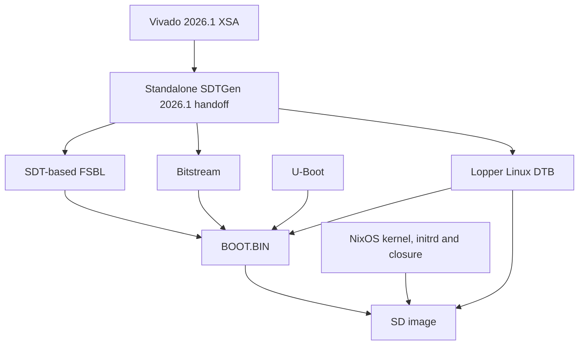

# nixos-cora-z7

Initial NixOS board support for the **Digilent Cora Z7-07S** (XC7Z007S,
one Cortex-A9, 512 MiB RAM). The default image cross-compiles from x86-64 Linux
to `armv7l-linux`. An AArch64 Linux builder is also exposed.

This is an initial bring-up cut. The Nix configuration is evaluated before
publication, but a complete image build and physical board boot still need to
be tested. No bootable binary release is provided yet.

## Hardware and software boundary



The SDT is used for both the FSBL and the Linux device tree. This project does
not call the legacy `device-tree-xlnx` generator. Lopper derives the Linux DTB,
which is explicitly supplied to the NixOS board module.
Vivado 2026.1 supplies standalone `sdtgen` for the XSA-to-SDT step. **Vitis is
not required.** The subsequent build uses Nix, including the open-source AMD
FSBL build tools and native Bootgen.

Pinned versions:

| Component | Version |
|---|---|
| Required hardware export | Vivado 2026.1, `xc7z007sclg400-1`, with bitstream |
| SDT generator | Standalone `sdtgen` from Vivado 2026.1 |
| FSBL / libmetal / Bootgen | AMD 2026.1 release commits |
| Lopper | AMD 2026.1 release, 1.3.2 |
| Linux | AMD 2026.1 LTS recipe pin, 6.18.10 |
| U-Boot | AMD 2026.1 recipe pin, 2026.01 |
| NixOS | 25.11, exact inputs in `flake.lock` |

Exact AMD revisions and verified unpacked source hashes are in
`pkgs/sources.nix`. The local release module/overlay extends `nixos-xlnx`'s
BOOT.BIN and SD-image support to 2026.1; its upstream release enum currently
stops at 2025.1. No old-release FSBL recipe is used.

The bundled **reference XSA is from 2024.1** and is copied unchanged from
[meta-pseudo-design at f94be4054df3](https://github.com/PseudoDesign/meta-pseudo-design/blob/f94be4054df3356cba288fa8af978a8321a0a322/meta-pd-xilinx/recipes-bsp/hdf/files/cora-z7.xsa).
It contains `cora-z7-wrapper.bit` and the PS7 initialization files. Its SHA-256
is `5c85b95f291576c8e011ad972145478d2f325502dd41b88c99ad3d423405ee40`.
The exported design's HWH contains the processing-system block and no separate
PL peripheral IP. Keep this export as a baseline; it is not accepted by the
2026.1 preparation script. Re-export the design with your new Vivado install.

## Prepare the SDT once

Clone the repository on a Linux workstation with Nix and AMD Vivado 2026.1:

```bash
git clone https://github.com/PseudoDesign/nixos-cora-z7.git
cd nixos-cora-z7

# Substitute your actual Vivado installation directory.
source /path/to/AMD/Vivado/2026.1/settings64.sh
./scripts/prepare-sdt.sh /path/to/cora-z7-07s.xsa
git add hardware/sdt
```

Generate the bitstream in Vivado, then export hardware with **Include
bitstream** enabled. The equivalent Tcl command in your open project is:

```tcl
write_hw_platform -fixed -include_bit -force -file /path/to/cora-z7-07s.xsa
```

The export must use the Cora Z7-07S part and preserve UART0, SD0, GEM0 and USB0
MIO wiring and 512 MiB DDR. The wrapper accepts any single exported `.bit`
filename. `CUSTOM_SDT_REPO` must be unset so generation uses the repository
shipped with your Vivado installation.

`python3` must be available. `nix develop` supplies Python and native inspection
tools if needed; AMD tools must be installed separately. The wrapper adds the
board include last, after SDTGen finishes, so generated properties cannot
override the 07S corrections. This also avoids release-specific custom-include
option differences in SDTGen.

The script verifies your XSA part and version, generates the real SDT,
includes `hardware/cora-z7-07s.dtsi`, and records source/output hashes in
`hardware/sdt/handoff.json`. It copies the input XSA into the handoff as
`hardware.xsa` and the exported bitstream as `system.bit`, so the build does
not depend on the original Vivado project path. Builds reject a missing or
modified handoff, or a changed board DTSI.
The generated directory is intentionally empty in the initial repository
except for its README: AMD tools were unavailable during implementation.

**Stage the generated files before building.** A Git-backed flake excludes
untracked files, so running SDTGen without `git add hardware/sdt` is insufficient.
After generation, the SDT directory can be committed and shared with builders
that do not have AMD tools installed.

## Cross-compile

Add your public SSH key in `configuration.nix` if you want remote access.
Then build on an x86-64 Linux workstation:

```bash
# Check the smallest hardware-dependent output first.
nix build .#linux-dtb -L --out-link result-dtb

# Build and package the firmware independently.
nix build .#boot-bin -L --out-link result-boot

# Build the complete SD image; no ARM emulation is required.
nix build .#sdImage -L
```

Equivalent explicit configuration output:

```bash
nix build .#nixosConfigurations.cora-z7-07s.config.system.build.sdImage -L
```

On an AArch64 Linux builder, `nix build .#sdImage -L` selects the AArch64-to-ARMv7
cross build automatically. The explicit configuration is
`cora-z7-07s-aarch64-builder`.

Useful outputs: `.#kernel`, `.#fsbl`, `.#linux-dtb`, `.#boot-bin`, `.#sdImage`.
An official ARMv7 binary cache is not available, so allow time and disk space
for a substantial source build. Start with the committed lock file; an input
upgrade is a separate change from the initial board bring-up.

## Write the SD card and test

The uncompressed image is under `result/sd-image/*.img`. It contains:

| Partition | Contents |
|---|---|
| 1, FAT (128 MiB) | `BOOT.BIN`: SDT FSBL, exported bitstream, U-Boot, control DTB |
| 2, ext4 | NixOS store/root, kernel/initrd/DTB and `/boot/extlinux/extlinux.conf` |

Write the image using your usual image writer, selecting the intended SD card.
Set the Cora boot jumper to microSD and attach its USB UART. Serial settings are
**115200 baud, 8N1, no flow control**. The initial local login is **root / nixos**;
change it after boot. SSH accepts public keys only, including for root.

Record this first-boot sequence:

1. FSBL completes and U-Boot reports approximately 512 MiB DRAM.
2. U-Boot reads the SD card and finds the extlinux configuration on partition 2.
3. The kernel reports one CPU, initializes SD0 and mounts the ext4 root.
4. The NixOS serial login appears; log in and run `uname -a`, `lscpu`,
   `findmnt /`, `ip -br address`, and `systemctl --failed`.
5. Check Ethernet DHCP and SSH with the public key you configured.

If U-Boot stops before Linux, useful diagnostic commands are:

```text
mmc list
mmc dev 0
part list mmc 0
ls mmc 0:1 /
ls mmc 0:2 /boot/extlinux/
printenv bootcmd boot_targets kernel_addr_r ramdisk_addr_r fdt_addr_r
sysboot mmc 0:2 any 0x03000000 /boot/extlinux/extlinux.conf
```

The DTB is also packaged at `0x00100000` for U-Boot's external control-tree
handoff. Extlinux supplies the Linux DTB. Default runtime load addresses are
kernel `0x02000000`, initrd `0x03100000`, DTB `0x01f00000`; record component sizes
and the serial log if loading fails.

## Board corrections and scope

The board DTSI carries forward the original UART0, SD0, GEM0/MDIO PHY address 1,
and ULPI USB-host wiring. It removes CPU1, its trace unit, and its trace funnel
input, and reduces the PMU resources to CPU0. Lopper's Linux conversion alone
does not remove the second core from AMD's generic Zynq description.

Boot-critical SD, ext4 and console drivers, plus MACB and the Realtek PHY driver,
are built into the kernel. The initrd uses gzip and a small shell-based stage1.
There is no desktop and no Mender integration in this cut. The old project's
generic UIO boot argument is omitted. If your new XSA adds PL peripherals, add
their Linux drivers and any required access configuration.

The Cora has no MAC-address EEPROM. Its sticker contains the assigned address;
configure it during later network integration. Do not assume the first-boot
MAC is stable across reboots.

NixOS generations cover the OS/kernel/initrd/DTB. Overwriting `BOOT.BIN` changes
the FSBL, U-Boot and bitstream separately. Automatic firmware rollback and
power-failure-safe firmware updates are not implemented here. Keep the working
Yocto SD card or an image backup for recovery during bring-up.

## Licenses and references

Original repository code is MIT. The upstream modules are referenced as a
pinned flake input, and retain their MIT license. The local release adapter
and FSBL recipe are adapted from that project; its notice is preserved in
`COPYING.nixos-xlnx`. Linux, U-Boot, AMD firmware
and generated device-tree sources retain their individual upstream licenses;
the repository license does not replace the licenses of image contents.

- [nixos-xlnx](https://github.com/chuangzhu/nixos-xlnx)
- [AMD SDTGen 2026.1](https://github.com/Xilinx/system-device-tree-xlnx/tree/af0bf525f0b466b6266cfd92ef6fccd92ebed84e)
- [AMD Linux 2026.1 recipe](https://github.com/Xilinx/meta-xilinx/blob/rel-v2026.1/meta-xilinx-core/recipes-kernel/linux/linux-xlnx_6.18.10-v2026.1.bb)
- [Lopper Linux domain conversion](https://github.com/Xilinx/lopper/blob/05dc7e4bf359b60f1e6f7ed7074740afd7955a63/lopper/assists/gen_domain_dts.py)
- [Original Yocto Cora configuration](https://github.com/PseudoDesign/meta-pseudo-design/tree/scarthgap/meta-pd-xilinx)
