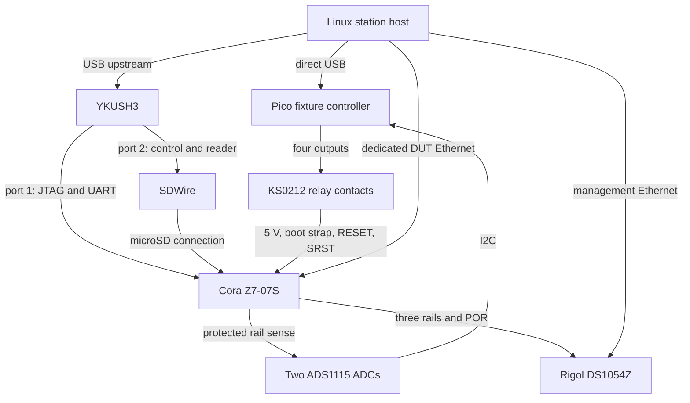

# Cora provisioning and qualification station

Design revision: **0.1**, 2026-10-04. One permanently wired device lane.

After one assembly and commissioning session, the station is intended to rewrite
the boot card, recover failed software, select SD/JTAG boot, operate both resets,
capture power waveforms, and run authorized provisioning jobs without moving
cables, jumpers or probes. Hardware replacement and testing fresh irreversible
fuse states still require another physical device.

This cut is an engineering design and interface contract. No controller
firmware, station daemon, signed boot implementation or fuse programmer is
implemented by this directory. No physical acceptance test has run. The supplied
configuration intentionally contains unresolved identities and disables
irreversible operations. It must not be treated as a commissioned lane.

## Baseline and decisions

| Component | Selection | Status |
| --- | --- | --- |
| Device under test (DUT) | Digilent Cora Z7-07S, PCB Rev B | Owned; variant/revision identified from photographs |
| Relay board | Inland KS0212, Micro Center SKU 350892 | Owned; product listing identifies the Keyestudio part |
| Oscilloscope | Rigol DS1054Z, Ethernet/SCPI | Owned; exact model/serial/firmware to record with `*IDN?` |
| Fixture controller | Raspberry Pi Pico H, RP2040, USB CDC | Selected; independently powered |
| Boot-media mux | 3mdeb SDWire, micro-USB version | Selected; shipping to the US offered by supplier |
| USB isolation | Yepkit YKUSH3 | Selected; separate switched ports for Cora and SDWire |
| Rail telemetry | Two ADS1115 breakouts with protected sense carrier | Selected; supplements the scope |
| Host | Existing Linux machine, preferably NixOS | Reuse; does not need to be the image builder |

The Pico replaces the earlier Uno proposal: native USB avoids the usual
USB-to-serial DTR reset circuit, and 3.3 V GPIO fits the relay board's intended
Pi interface. Firmware must still explicitly disable any USB-triggered reset
or bootloader entry. The Pico is a fixture controller, not the board being tested.
Its 40-pin layout is **not** the Raspberry Pi computer header layout; an adapter
is required. The earlier Uno and its 9 V supply are removed from the BOM.

Retain the existing scope; do not buy another one for this lane. Keep the two
ADCs for continuous rail/discharge checks while the scope captures transients.
ADC measurements alone do not establish power-sequence compliance.

## Read/build order

1. [Bill of materials](bom.md): existing equipment and remaining purchases.
2. [Hardware and harness](hardware.md): named connections, defaults and sensing.
3. [Automation contract](automation.md): ownership, operations and failure behavior.
4. [Commissioning and qualification](qualification.md): acceptance gates and tests.
5. [Lane template](lane.example.json): proposed assignments, disabled until populated.
6. [References and unresolved details](sources.md): evidence behind the design.

## Connections

The diagram separates control paths; it is not a schematic. Power topology and
contact polarity are specified in [hardware.md](hardware.md).

## What unattended operation means

The normal loop is: identify and exclusively reserve the lane, establish the
approved off state, attach SD media to the host, write and verify exact image
bytes, return media to the DUT, select the boot mode, arm measurements, boot,
collect observations, and preserve a result with artifact and fixture identities.

Recovery from an invalid SD image uses the same external write path, independent
of FSBL, U-Boot, Linux or the device network. TFTP is useful once an authorized
loader exists, but is not the baseline recovery mechanism.

JTAG recovery is available only when the target's security state allows it.
After debug restrictions, recovery must use an authenticated SD recovery image
that was tested before applying the restriction. A physically connected JTAG
cable does not imply that JTAG remains usable.

Automation may exercise reversible operations once the corresponding fixture
gates pass. Fuse/key/debug-lock jobs remain separate, exact-target operations
with explicit external authorization. The present design does not authorize
burning this board's fuses.

## Failure policy

| Event | Required behavior |
| --- | --- |
| Host process exits or USB connection disappears | Pico holds established outputs; never power-cycle from a heartbeat timeout |
| Pico resets or loses its own power | Passive defaults connect DUT power, select SD, and release both reset contacts; report state unknown on return |
| Scope unavailable or an acquisition clips | No electrical qualification result; stop jobs that require this evidence |
| SD writer or mux command fails | Do not boot the candidate; reconcile route and media before retrying an ordinary image write |
| Fuse operation times out or host restarts | `UNCERTAIN`; keep available power, refuse destructive retries, reconcile explicitly |
| Unexpected target disconnect after debug lockdown | Evaluate against the approved lifecycle plan; do not assume a failed device |
| Fixture wiring, supplies, firmware or probes change | Invalidate affected qualification results |

Normally closed power is a deliberate continuity choice: a controller failure
can turn an intentionally off DUT **on**. It cannot be used as an emergency-off
guarantee. A controller reboot invalidates an in-progress SD/off-state job.
The mux must be qualified to preserve host/DUT electrical exclusivity in that
event. No software-controlled relay can guarantee continuity through loss of
the DUT's upstream power source; use backed-up power for irreversible work.

## Security and Kaiba boundary

The trusted station host, fixture firmware, programmers and signer adapters are
part of the provisioning trust boundary. Use a dedicated DUT network with no
route to the scope or management services. Do not expose arbitrary SCPI, relay,
JTAG or shell commands through a fleet-facing API. Untrusted build/test jobs
submit constrained jobs to the station service rather than opening its devices.

Public Nix builds produce software and manifests. Signing/private personalization
runs outside the Nix store, caches and public logs. This station supplies
observations, not hardware attestation. A future Kaiba profile chooses policy,
authorizes operations and consumes the evidence; Pi remains the first release
target. See the [generic security boundary](../security/README.md).

## Implementation milestones

| Milestone | Deliverable | Acceptance |
| --- | --- | --- |
| M0 | Assemble harness, label identities, qualify relay defaults and sense paths | G0/G1 in qualification procedure |
| M1 | Reproducible Pico firmware and read-only host inventory | No output transition on reconnect; accurate telemetry |
| M2 | SDWire/YKUSH adapters, lane lock, image write/readback and UART capture | Recover repeatedly from a deliberately invalid image |
| M3 | Rigol adapter, waveform analysis and evidence bundles | Repeated normal/abnormal power sequences with explainable results |
| M4 | Signed boot/FIT/verity implementation and negative tests | Correct failure at each authenticated boundary |
| M5 | Qualified read-only inspection and explicit irreversible operation adapter | Execute-once/reconciliation rehearsal before real writes |
| M6 | Second lane and device-binding tests | Copies fail on another functioning device under the claimed policy |

The engineering design is now recorded. Firmware/software implementation and
physical qualification are separate milestones, not completed by this commit.
